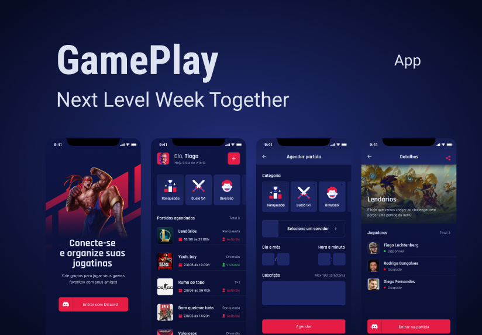

<h1 align="center">
   <strong>GamePlay</strong>
</h1>

<h1 align="center">
    
</h1>

# 💻 Sobre o projeto
O aplicativo GamePlay te ajuda a conectar-se e se organizar nos momentos de diversão com os amigos. Jogue seus jogos favoritos com seus amigos através de grupos criados no aplicativo e utilize o Discord como forma de autenticação!

Projeto desenvolvido durante a 🚀 **NLW - Next Level Week** 🚀 - Oferecida pela **Rocketseat**

---

## 🚨 Como baixar o projeto
Antes de começar, você vai precisar ter instalado em sua máquina as seguintes ferramentas: Git, Node.js e Expo. Além disto ter um editor para trabalhar com o código como VSCode

### 🏁 Para rodar a aplicação 

```bash

    # Clonar o repositório
    $ git clone https://github.com/milealmeida/nlw-react-native-gameplay

    # Entrar no diretório
    $ cd {nomepasta}

    # Instalar as dependências
    $ yarn install

    # Iniciar o projeto no terminal
    $ expo start

```

Lembre-se de criar o seu App no servidor do Discord para obter as credencias de autenticação. Em seguida, defina no arquivo .env as configurações do seu App (remova o example do arquivo .env.example).

```bash
    REDIRECT_URI=
    SCOPE=
    RESPONSE_TYPE=
    CLIENT_ID=
    CDN_IMAGE=
```

---
Desenvolvido por Milena Almeida 💙